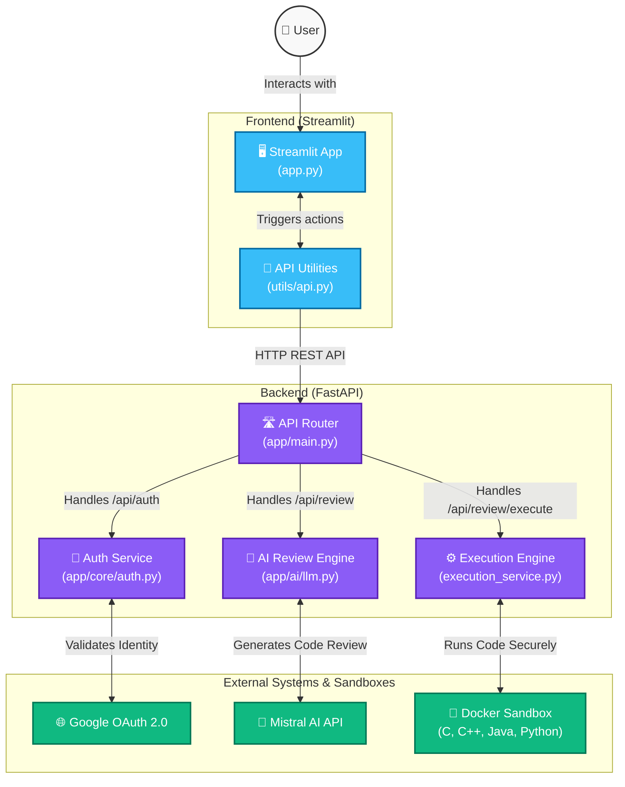

# Code Reviewer AI Architecture

Below is the high-level system architecture of the Code Reviewer AI workspace, showcasing how the Streamlit frontend interacts with the FastAPI backend, authentication systems, and sandboxed execution environments.

## Components

### 1. Frontend (Streamlit)
- **`app.py`**: The main entry point for the user interface. It renders the Monaco code editor, chat interface, and settings panel. It also handles the "Cyber Dark" UI styling and Light/Dark mode toggles.
- **`utils/api.py`**: Contains helper functions to make HTTP requests to the FastAPI backend, passing authentication tokens securely.

### 2. Backend (FastAPI)
- **`app/main.py`**: The central routing hub for the REST API. It connects all sub-routers (Authentication, AI Review, Code Execution) and handles CORS middleware.
- **`app/core/auth.py`**: Manages the Google OAuth 2.0 flow, verifies Google tokens, and generates secure JSON Web Tokens (JWT) for user sessions.
- **`app/ai/llm.py`**: Connects to the Mistral AI API. It structures the prompt with the user's code, language, and request, and streams the AI's response back to the client.
- **`app/services/execution_service.py`**: The execution engine that safely runs user-submitted code. It implements both a Universal STDIN/STDOUT runner (for C, C++, and Java via Docker) and a native python AST wrapper. It also includes a `MockSandboxExecutor` for execution on Windows systems without Docker.

### 3. External Services
- **Google OAuth**: Provides secure, passwordless sign-in for users.
- **Mistral AI**: The Large Language Model responsible for analyzing code, identifying bugs, and suggesting improvements.
- **Docker Sandbox**: Isolated Linux environments used to safely compile and execute arbitrary code without risking the host system.
