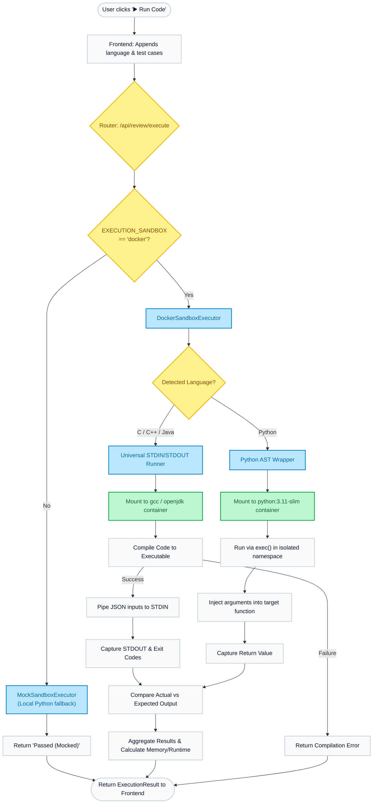

# Execution Engine Data Flow

This flowchart illustrates the decision matrix and execution pipelines utilized when a user submits arbitrary code to be executed securely.

```mermaid
flowchart TD
    %% Styling
    classDef default fill:#f8fafc,stroke:#cbd5e1,stroke-width:2px,color:#0f172a;
    classDef decision fill:#fef08a,stroke:#eab308,stroke-width:2px,color:#854d0e;
    classDef action fill:#bae6fd,stroke:#0284c7,stroke-width:2px,color:#0369a1;
    classDef secure fill:#bbf7d0,stroke:#16a34a,stroke-width:2px,color:#166534;
    
    Start(["User clicks '▶️ Run Code'"]) --> FE["Frontend: Appends language & test cases"]
    FE --> API{"Router: /api/review/execute"}:::decision
    
    API --> EnvCheck{"EXECUTION_SANDBOX<br>== 'docker'?"}:::decision
    
    EnvCheck -- Yes --> DockerExec["DockerSandboxExecutor"]:::action
    EnvCheck -- No --> MockExec["MockSandboxExecutor<br/>(Local Python fallback)"]:::action
    
    DockerExec --> LangCheck{"Detected Language?"}:::decision
    
    %% STDIN/STDOUT Pipeline
    LangCheck -- C / C++ / Java --> STDIN["Universal STDIN/STDOUT Runner"]:::action
    STDIN --> Mount["Mount to gcc / openjdk container"]:::secure
    Mount --> Compile["Compile Code to Executable"]
    Compile -->|Success| Pipe["Pipe JSON inputs to STDIN"]
    Compile -->|Failure| CompErr["Return Compilation Error"]
    Pipe --> Cap["Capture STDOUT & Exit Codes"]
    
    %% Python Pipeline
    LangCheck -- Python --> AST["Python AST Wrapper"]:::action
    AST --> MountPy["Mount to python:3.11-slim container"]:::secure
    MountPy --> ExecScope["Run via exec() in isolated namespace"]
    ExecScope --> Inject["Inject arguments into target function"]
    Inject --> CapRet["Capture Return Value"]
    
    %% Evaluation
    Cap --> Compare["Compare Actual vs Expected Output"]
    CapRet --> Compare
    MockExec --> Mock["Return 'Passed (Mocked)'"]
    
    Compare --> Agg["Aggregate Results & Calculate Memory/Runtime"]
    Mock --> End(["Return ExecutionResult to Frontend"])
    Agg --> End
    CompErr --> End
```
