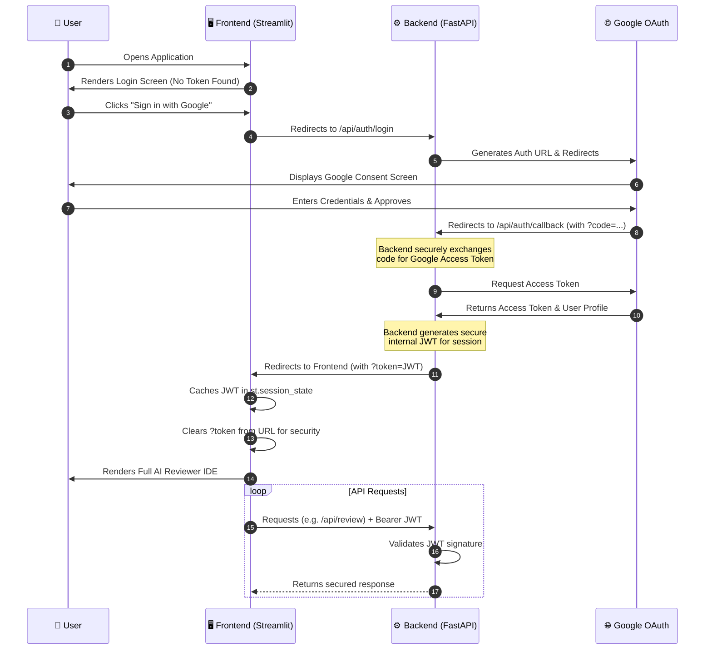

# Google OAuth 2.0 Flow

This sequence diagram illustrates the secure authentication lifecycle between the Streamlit Frontend, FastAPI Backend, and Google's OAuth servers.

```mermaid
sequenceDiagram
    autonumber
    
    participant U as 👤 User
    participant F as 🖥️ Frontend (Streamlit)
    participant B as ⚙️ Backend (FastAPI)
    participant G as 🌐 Google OAuth
    
    U->>F: Opens Application
    F->>U: Renders Login Screen (No Token Found)
    U->>F: Clicks "Sign in with Google"
    F->>B: Redirects to /api/auth/login
    B->>G: Generates Auth URL & Redirects
    
    G->>U: Displays Google Consent Screen
    U->>G: Enters Credentials & Approves
    
    G->>B: Redirects to /api/auth/callback (with ?code=...)
    Note over B: Backend securely exchanges<br/>code for Google Access Token
    B->>G: Request Access Token
    G->>B: Returns Access Token & User Profile
    
    Note over B: Backend generates secure<br/>internal JWT for session
    B->>F: Redirects to Frontend (with ?token=JWT)
    
    F->>F: Caches JWT in st.session_state
    F->>F: Clears ?token from URL for security
    F->>U: Renders Full AI Reviewer IDE
    
    loop API Requests
        F->>B: Requests (e.g. /api/review) + Bearer JWT
        B->>B: Validates JWT signature
        B-->>F: Returns secured response
    end
```
